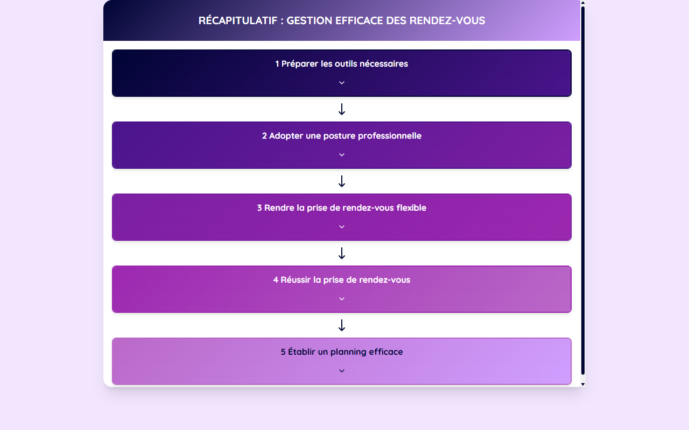

# Récapitulatif Rendez-Vous — Gerer vos RDV

**Course:** Gerer vos RDV  
**Slide:** 9  
**Live URL:** https://microneedling-recapitulatif-o7no.edtechiecorp.com  
**Stack:** Next.js · Tailwind CSS · TypeScript · GitHub Pages  

## What this slide does

Summary and recap slide for the appointment management module, consolidating the key concepts covered throughout the course. Learners review best practices for scheduling, confirmations, last-minute changes, and client communication. Positioned as slide 9, this is a near-final slide that helps practitioners retain and apply the full appointment workflow before completing the module.

## Screenshot

## Usage

This slide is embedded as an iframe inside Coassemble at the live URL above. DNS is managed via Cloudflare (`edtechiecorp.com`). To update the slide, push to the `main` branch — GitHub Actions will rebuild and redeploy automatically.
